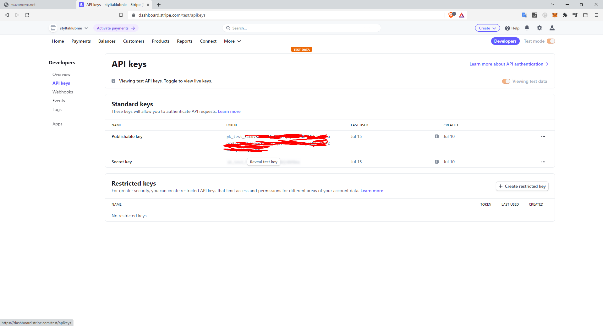
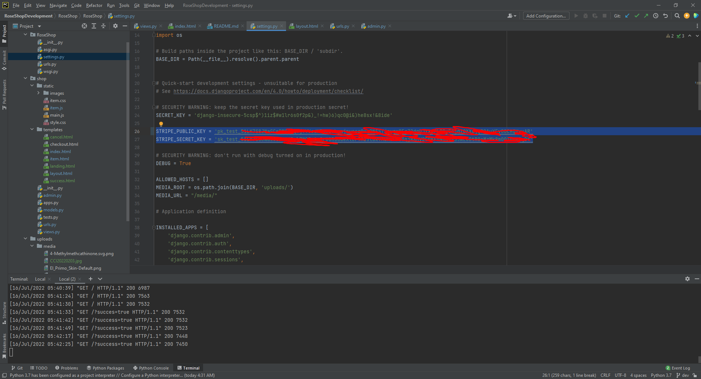

# wazonowo.net
wazonowo.net is template for e-commerce site, made with Django.


## Setup
First, you need to clone this repository

`$ git clone https://github.com/Style77/wazonowo.net`

and change directory

`cd wazonowo.net/RoseShop`

after cloning, you need to install all required packages using command `$ pip install -r requirements.txt`, renaming `.env.SAMPLE` to `.env` and filling all config variables <small>`(Stripe variables are detailed in next paragraph)`</small>.\
Then you have to migrate database using commands:

`$ python manage.py migrate and then`
`$ python manage.py makemigrations`

To run actual server use `$ python manage.py runserver`, and go to http://127.0.0.1:8000/

### Creating superuser account

Creating account is little tricky, first you need to make [superuser](https://docs.djangoproject.com/en/1.8/intro/tutorial02/) account. 
Run the following command:

`$ python manage.py createsuperuser`

Enter your desired username and press enter.

`Username: admin`

You will then be prompted for your desired email address:

`Email address: admin@example.com`

The final step is to enter your password. You will be asked to enter your password twice, the second time as a confirmation of the first.

```
Password: ********** 
Password (again): *********
Superuser created successfully.
```


When your superuser is created, you can already log in to page as superuser (it really doesn't matter)\
or create new account in admin panel.

To get to admin panel just go to http://127.0.0.1:8000/admin

### Stripe setup

Setuping Stripe is pretty easy. First you need to create [Stripe](https://dashboard.stripe.com/register) account. \
Now you need to go to [Developers tab](https://dashboard.stripe.com/test/developers), then to `API keys` then copy `Publishable key` and `Secret key` to `settings.py` file




### Creating product
First you need to go to [Stripe products tab](https://dashboard.stripe.com/test/products), click `Add Product` \
Fill out all information and click `Save product`. Find `product ID` and `price ID` and save them somewhere because we will need them in second.

Go to [admin panel](127.0.0.1:8000/admin) and `Add` Item, fill out all fields, and create new `Price`, price field is calculated in cents <small>(albo w groszach)</small>\
Do not forget about including `product ID` and `price ID`, because it's the most important part!


# Important informations

All pricing details from payment gateway [Stripe](https://stripe.com/en-pl/) are on their [site](https://stripe.com/en-pl/pricing#pricing-details)

While publishing, we need to remember about:
- .env
- changing settings.py, for example host, allowed host etc.
- ...
